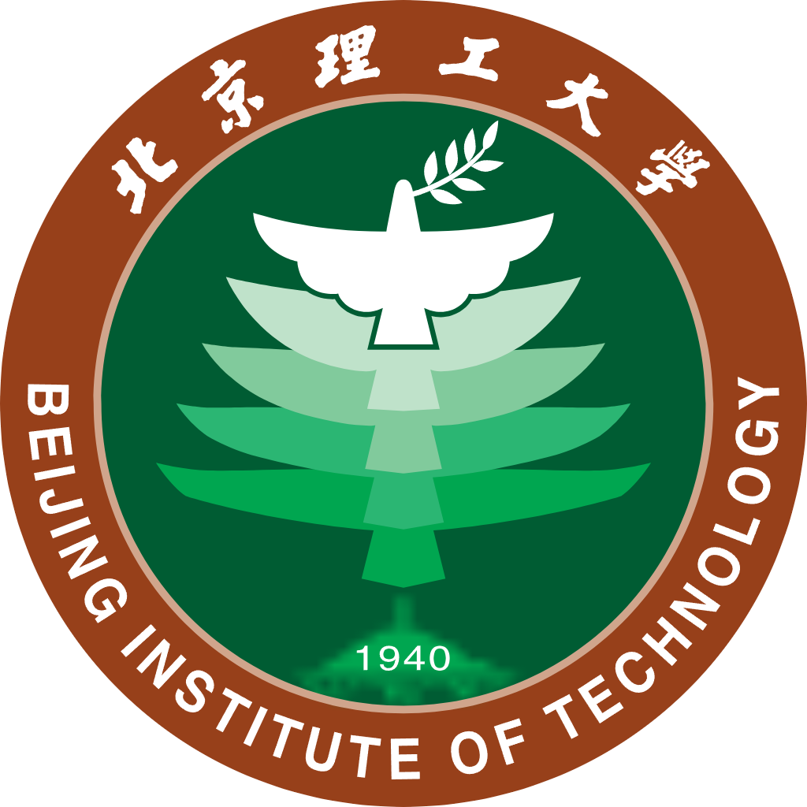
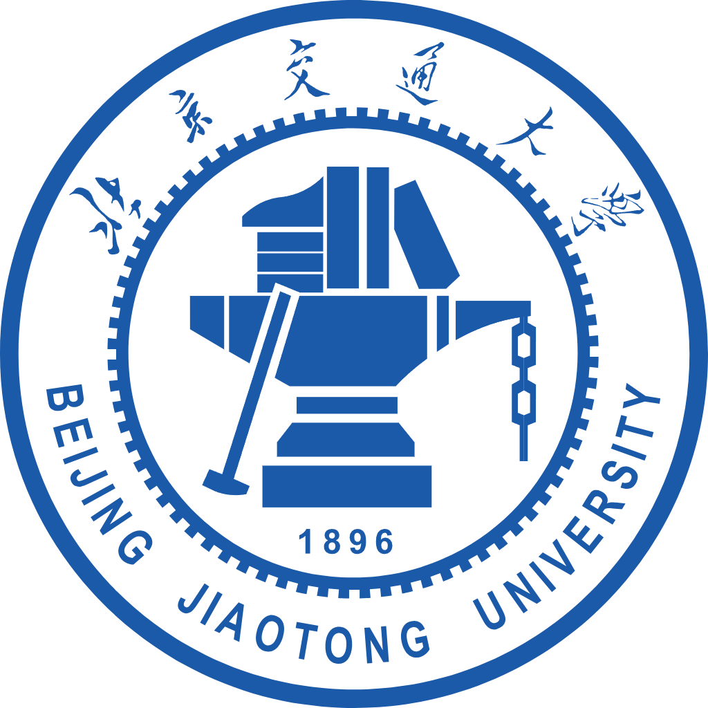

I am currently a master student enrolled in the Fall 2022 semester in the [School of Optics and Photonics](https://opt.bit.edu.cn/) at [Beijing Institute of Technology (BIT)](https://www.bit.edu.cn/).

Prior to joining BIT, I pursued my Bachelor's(BS) degree in Measurement and Control Technology and Instrument from the [School of Mechanical, Electronic and Control Engineering](https://mece.bjtu.edu.cn/) at [Beijing Jiaotong University (BJTU)](https://www.bjtu.edu.cn/).

I am very fortunate to be under the guidance of [Prof. Yong Song](https://opt.bit.edu.cn/jsdw/jsml/gdyqyjs/f491c35fcedd48548d87063037b5e67c.htm) from the [BCI-Lab](https://bit-bcilab.github.io/) at BIT and advised by [Prof. Xining Xu](https://faculty.bjtu.edu.cn/8929/) from the Rail Transit Intelligent Detection Technology Research Institute at BJTU.

My research interests encompass Computer Vision (Detection and Tracking), Knowledge Distillation, Hardware Deployment under the UAV Platform.

Currently, my work focuses on object detection and tracking algorithms in complex low-altitude aerial scenes, design of knowledge distillation framework for specific scenes, multi-object rotation detection algorithm based on optical remote sensing images and salient object detection, with the applications in complex low altitude scenes.

📰 News
======
- 2024.05: 🎉🎉 [LSN](https://ieeexplore.ieee.org/document/10521630) is accepted by IEEE Transactions on Geoscience and Remote Sensing！
- 2024.05: 🎉🎉 [RDR-KD](https://ieeexplore.ieee.org/document/10522745) is accepted by IEEE Geoscience and Remote Sensing Letters！
- 2022.09: 😄 I join BCI-Lab as a master researcher!

🎖 Honors and Awards
======
- 2023 **Graduate First Prize Scholarship**, _Beijing Institute of Technology_
- 2023 **Outstanding Student**, _Beijing Institute of Technology_
- 2023 **Outstanding League Cadres**, _Beijing Institute of Technology_
- 2023 **Advanced Individual**, _Beijing Institute of Technology Graduate Student Association_
- 2022 **First Academic Scholarship for New Graduate Students**, _Beijing Institute of Technology_
- 2022 **Outstanding Individual**, _Beijing Winter Olympics Volunteers_
- 2021 **Merit Award**, _National Undergraduate Training Program for Innovation and Entrepreneurship_
- 2021 **First Prize at the Beijing Municipal Level**, _The 11th Challenge Cup_
- 2020&2021 **Academic Excellent Scholarship**, _Beijing Jiaotong University_
- 2020 **Merit Award**, _The Third 3D Printing Competition at Tsinghua University_

🖥️ Internships
======
- 2021.09 - 2022.2, Chaoyang District People’s Government of Beijing Municipality

✉️ Contact
======
Welcome to contact with me via my email:  [huangjinxiang@bit.edu.cn](huangjinxiang@bit.edu.cn) / [jinxiang.kd@gmail.com](jinxiang.kd@gmail.com)

