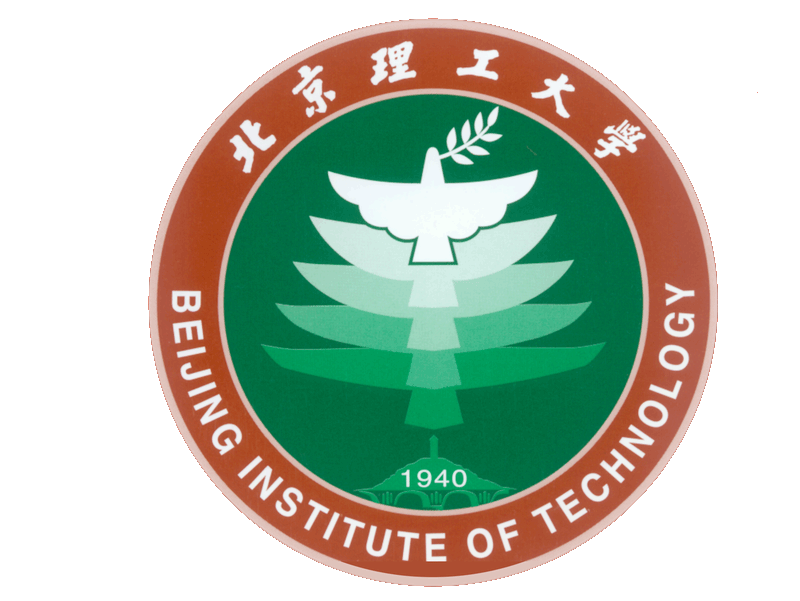

I am currently a master student enrolled in the Fall 2022 semester in the [School of Optics and Photonics](https://opt.bit.edu.cn/) at [Beijing Institute of Technology (BIT)](https://www.bit.edu.cn/).

Prior to joining BIT, I pursued my Bachelor's(BS) degree in Measurement and Control Technology and Instrument from the [School of Mechanical, Electronic and Control Engineering](https://mece.bjtu.edu.cn/) at [Beijing Jiaotong University (BJTU)](https://www.bjtu.edu.cn/).

I am very fortunate to be under the guidance of [Prof. Yong Song](https://opt.bit.edu.cn/jsdw/jsml/gdyqyjs/f491c35fcedd48548d87063037b5e67c.htm) from the [BCI-Lab](https://bit-bcilab.github.io/) at BIT and advised by [Prof. Xining Xu](https://faculty.bjtu.edu.cn/8929/) from the Rail Transit Intelligent Detection Technology Research Institute at BJTU.

My research interests encompass Computer Vision (Detection and Tracking), Knowledge Distillation, Hardware Deployment under the UAV Platform.

Currently, my work focuses on object detection and tracking algorithms in complex low-altitude aerial scenes, design of knowledge distillation framework for specific scenes, multi-object rotation detection algorithm based on optical remote sensing images and salient object detection, with the applications in complex low altitude scenes.

